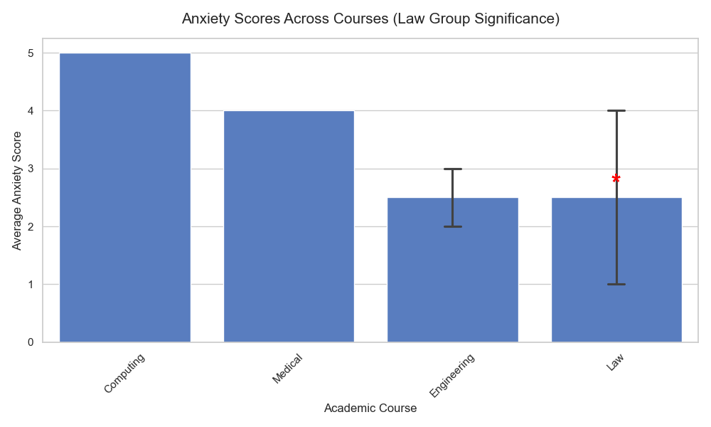

# 🧠 Student Mental Health: Predictive & Statistical Analysis
### **A Professional Data Science Pipeline for Psychological Research**

---

## Project Overview
This research analyzes how academic majors and lifestyle factors influence student mental health (**Depression, Anxiety, and Stress**). 

The current study was based on a large dataset including 7,022 student observations, encompassing demographic variables, academic characteristics, and measures of mental well-being.

The project uses a data-driven pipeline to identify high-risk student populations through:
* **Statistical Analysis:** Comparing distress levels across disciplines (e.g., Law, Medicine, and Engineering).
* **Risk Prediction:** A custom model that calculates the probability of clinical mental health outcomes.
* **Scientific Validation:** Using Factor Analysis (EFA) to verify the internal consistency of the psychological metrics.
---

## 🔬 Key Research Hypotheses
* **H1:**: Academic Discipline Impact: Students enrolled in STEM fields will report higher levels of psychological distress (Stress, Anxiety, and Depression) compared to peers in the Humanities and Social Sciences, driven by higher academic workloads.

* **H2:**: Dimensionality Reduction: Integrating individual distress metrics into a single "Mental Well-being Index" (using dimensionality reduction techniques) will reveal statistically significant differences between groups that are not apparent when analyzing each metric separately.

* **Phase 2:**: Revised Hypothesis (Post-Analysis)
H3: Intra-STEM Variance: Following the rejection of H1, we hypothesize that significant variance exists within the STEM category. Specifically, courses with intensive clinical or technical demands (e.g., Medicine and Engineering) will exhibit higher distress levels compared to other academic tracks.


## 🛠 File Structure & Architecture
The project follows a **Modular Clean Architecture** to ensure reproducibility and scientific rigor.

```bash
Final_project_student_mental_health_analysis/
│
├── DATA/               # Data storage
│   ├── st_1.csv        # Original raw dataset
│   └── clean_data.csv  # Scientifically processed dataset
│
├── SRC/                # Source code (Logic modules)
│   ├── data_cleaning.py# Pre-processing & STEM mapping
│   ├── stats_analysis.py # T-Tests, ANOVA & Environment setup
│   ├── predictive_modeling.py # Risk Prediction Logic
│   ├── unsupervised.py # Factor Analysis (EFA) & KMO testing
│   └── visualization.py# Scientific plotting & Heatmaps
│
├── reports/            # Exported research results
│   ├── figures/        # Scientific PNG charts
│   └── tables/         # Statistical CSV & TXT Reports
│
├── logs/               # Research audit logs
│   └── pipeline.log    # Full system history
│
├── tests/              # Automated QA suite
│   └── test_pipeline.py# 8-Stage Validation Suite
│
├── main.py             # Entry point (Orchestrator)
└── requirements.txt    # Project dependencies

```

## How to Run
1. **Install Dependencies**: 
   `pip install -r requirements.txt`
2. **Execute Analysis**: 
   `python main.py`
3. **Run Automated Tests**: 
   `python -m pytest tests/`


## Statistical Analysis and Key Findings

The research implemented a multi-stage statistical pipeline, progressing from broad categorical comparisons to a granular analysis of academic disciplines and a structural evaluation of psychological metrics.

### 1. Categorical Analysis: STEM vs. Non-STEM
The initial stage of the research investigated whether the broad classification into STEM (Science, Technology, Engineering, and Mathematics) and Non-STEM fields serves as a primary driver for mental health distress.
* **Statistical Observation:** While a T-Test revealed a statistically significant difference in distress scores between the groups ($p < 0.05$), the effect size and correlation coefficient were remarkably low ($r \approx 0.18$). 
* **Inference:** This indicates that while STEM students may face distinct pressures, the "STEM" label itself is a weak predictor of clinical outcomes. This finding necessitated a more granular approach, breaking down the data by specific academic majors.


### 2. Granular Analysis: Major-Specific Distress Profiles
Since the broad STEM classification failed to provide strong predictive power, we performed a granular breakdown by academic major. The results revealed that psychological distress is not uniform across disciplines; instead, each metric (Depression, Anxiety, and Stress) exhibited a distinct "peak" major where risk was significantly more prevalent.

* **Anxiety**: Specifically peaked in **Law** students, likely reflecting the high-stakes nature of the field.
* **Depression**: Showed the highest elevation among **Computer Science** students.
* **Stress**: Was most significant in **Medical** and **Engineering** tracks, correlating with high clinical and technical workloads.

*Note: While statistical analysis and visualization were conducted for all metrics, only the Anxiety distribution is presented below as a representative example of the major-specific distress profiles.*


*Figure 1: Statistical comparison of Anxiety scores across disciplines, highlighting the significant elevation in specific professional tracks.*

### 3. Advanced Statistical Diagnostics: Factor Analysis (EFA)

To determine if **Depression**, **Anxiety**, and **Stress** represent a single underlying factor of "Academic Distress" (Hypothesis 2), we conducted an Exploratory Factor Analysis (EFA) to test the feasibility of dimensionality reduction.

### **Diagnostic Results & Structural Integrity**
While the preliminary tests indicated some relationships between variables, the overall structure did not meet the academic requirements for a unified model:

* **Bartlett’s Test of Sphericity:** Achieved significance ($\chi^2 = 25.29, p < 0.001$), confirming the presence of basic correlations suitable for structure detection.
* **Kaiser-Meyer-Olkin (KMO) Measure:** Recorded at **0.487**. This value is below the acceptable threshold of **0.60**, indicating that the sampling adequacy is insufficient for a stable factor analysis.
* **Correlation Matrix:** As visualized in the heatmap, the inter-variable correlations were not strong enough to support the formation of a reliable latent construct.


### **Conclusion: Rejection of Hypothesis 2**
Due to the low KMO score, it was determined that the common variance between the three metrics was insufficient to justify a single "Academic Distress" factor.

**Consequently, Hypothesis 2 was rejected.** To maintain scientific rigor and ensure the accuracy of our findings, we proceeded with the analysis using the three distinct metrics independently 

---

## Predictive Risk Profile: Academic Hotspots

  The following table presents empirical risk Probability (%) for Clinical Distress (Score $\ge$ 4) by Major

| Academic Major       | Depression Risk | Anxiety Risk | Stress Risk |
| :------------------- | :-------------: | :----------: | :---------: |
| **Computer Science** |    **52.2%**    |    18.9%     |    18.0%    |
| **Law**              |      20.1%      |  **48.8%**   |    21.6%    |
| **Medical**          |      19.5%      |    20.5%     |  **49.1%**  |
| **Engineering**      |      20.0%      |    19.9%     |    19.0%    |
| **Others**           |      21.0%      |    19.3%     |    19.9%    |
